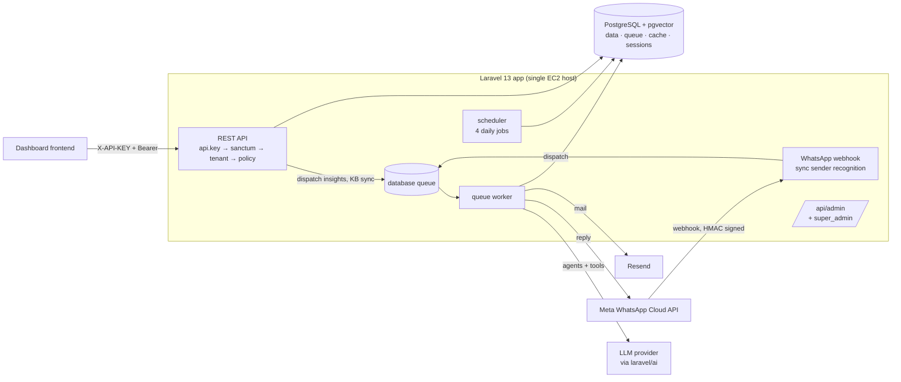

# System Design Assessment — Hospitality Ecosystem API

**Date:** 2026-09-19 · **Scope:** `main` @ `b195476` · **Method:** static review of the code, migrations, routes, jobs, and deploy pipeline. No load testing or production telemetry was available.

---

## 1. Summary

The core domain design is strong. Tenant isolation, access control, the transaction ledger, usage metering, and AI cost attribution are each built with clear invariants, and comments explain why each one holds. The test suite (532 Pest tests on real Postgres) enforces those invariants. For a codebase this young, that is unusually disciplined.

The risk is at the edges, not the core:

1. **The WhatsApp concierge pipeline** is the most exposed path: public, AI-driven, and the source of spend. It has no idempotency, no retries, no per-conversation ordering, and it identifies guests across tenants in a way that can pick the wrong one.
2. **Deployment and operations** have not kept pace with the application. A push to `main` goes straight to one EC2 host via `git pull`, with no test gate. Queue, cache, and sessions all run on the primary database.
3. **Several isolation guarantees depend on convention** in code paths that run outside an HTTP request, where the tenant scope is off.

None of these block today's pilot scale. Items 1 and 3 should be fixed before onboarding more properties onto the shared WhatsApp number.

### Scorecard

| Area | Rating | One-line verdict |
| --- | --- | --- |
| Domain modelling | 🟢 Strong | Enums everywhere, append-only ledger, explicit booking state machine |
| Multi-tenancy (HTTP) | 🟢 Strong | Global scope with correct `null` vs `[]` semantics, reset in `finally` |
| Multi-tenancy (async / AI) | 🟡 Adequate | Correct today, but relies on each tool filtering by hand |
| Access control | 🟢 Strong | Permission enum + same-hotel check; admin routes guarded by construction |
| WhatsApp / AI pipeline | 🔴 Weak | No dedupe, no retry, no ordering; cross-tenant guest ambiguity |
| AI cost control | 🟢 Strong / 🟡 | Excellent attribution; ceiling is shared, so one abuser can lock out staff |
| Data & search | 🟡 Adequate | Good indexes on ledger/metering; filtered vector search will degrade |
| Security | 🟡 Adequate | Webhook HMAC and pairing are good; tokens never expire, no API rate limit |
| Scalability | 🟡 Adequate | Fine for tens of hotels; DB-backed queue/cache is the first ceiling |
| Delivery / operations | 🔴 Weak | Deploy on push, no CI tests, in-place deploy, no observability stack |
| Testing & docs | 🟢 Strong | Real-Postgres tests, isolation + permission datasets, per-resource docs |

---

## 2. System overview

### 2.1 Components

### 2.2 Request paths

| Path | Stack | Notes |
| --- | --- | --- |
| Tenant API | `api.key → auth:sanctum → tenant → policy` | [routes/api.php](../routes/api.php) |
| Super-admin reporting | same + `super_admin`, applied to the whole file | [bootstrap/app.php](../bootstrap/app.php) |
| WhatsApp webhook | `whatsapp.signature` only | Recognises the sender synchronously, then queues the LLM work |
| Scheduled work | `routes/console.php` | Outcome matching 03:30, counter rebuild 04:00, cost flags 04:30, rooms to dirty 00:01 |

### 2.3 Data model (by concern)

- **Tenancy:** `hotel_groups` (the billing account) → `hotels` → everything else via `hotel_id`. Users reach hotels through `hotel_id`, the `hotel_user` pivot, or group-wide `group_role`.
- **Operations:** guests, rooms, reservations, stays, activities, tasks, teams, staff roles.
- **Revenue:** recommendations → bookings → transactions (append-only ledger with reversals) → recommendation outcomes.
- **Platform:** `event_log` (audit), `meter_events` / `usage_counters` (metering), `ai_usage_logs` / `ai_model_prices` (AI cost), `knowledge_chunks` (pgvector, 1536-d).

---

## 3. What is working well

These are deliberate design strengths. Keep them as the system grows.

1. **Tenancy semantics are exactly right.** [TenantContext](../app/Support/Tenancy/TenantContext.php) separates *unrestricted* (`null`) from *restricted to nothing* (`[]`). The global scope checks `!== null`, and [ResolveTenant](../app/Http/Middleware/ResolveTenant.php) resets the context in `finally` so a long-lived worker (Octane) cannot leak one tenant's context into the next request. `runForHotel()` / `withoutScope()` restore the previous state even when they throw.
2. **Guarded by construction.** The super-admin guard is applied to all of `routes/admin.php` in `bootstrap/app.php`, so a new route there cannot be left unprotected. The same thinking shows in the API-key middleware, which refuses requests outside local/testing when no key is configured instead of letting them through.
3. **Permissions are data, not role names.** `Permission` enum + `ChecksPermissions::allows()` (permission *and* same hotel). A deleted or out-of-scope staff role grants nothing instead of falling back to the defaults. `GET /api/permissions` reads the enum, so the frontend keeps up automatically.
4. **Financial integrity.** Transactions are append-only: the model throws on update and on delete, and corrections are reversals. Imports are made idempotent by `unique(hotel_id, source_system, external_reference)`.
5. **Metering is designed to be checked.** Idempotency keys on `meter_events`, counters that are updated incrementally, and a nightly rebuild that *logs* drift instead of hiding it. `MeteringService::safely()` makes sure a metering failure can never block the operation being metered.
6. **AI cost attribution.** [AiCostContext](../app/Support/Ai/AiCostContext.php) is a nestable stack. It attributes every provider call (including embeddings made inside a conversation) to an account and a trigger kind, and records failover attempts. Calls with no declared context are logged as `unattributed` instead of being guessed.
7. **AI output carries an evidence level.** Insights tied to a verified hotel record are recorded as L2. Anything else stays L3, and hallucinated source ids are dropped rather than linked.
8. **Webhook and pairing security.** Meta's HMAC is checked with `hash_equals`. Pairing codes are dedicated tokens that expire in 15 minutes, can be used once, and cannot be replaced by a login token.

---

## 4. Findings

Ordered by severity. Each finding says what happens, where, and what to do.

### 🔴 F1 — Guest identity is ambiguous across hotels on the shared WhatsApp number

**Where:** [SenderRecognitionService.php](../app/Services/SenderRecognitionService.php) `resolve()`

The platform uses one WABA number for every hotel ([WhatsAppMessageService](../app/Services/WhatsAppMessageService.php)). Guests are per-hotel rows, so the same person who has stayed at two client hotels has two `guests` rows with the same phone number. Recognition runs `Guest::where('phone_number', $phoneNumber)->first()` with no tenant scope and no ordering. Postgres can return either row.

**Impact:** the guest may get the other hotel's concierge, see the other hotel's reservation and activities, and create bookings and tasks under the wrong tenant. This is a cross-tenant data exposure caused by a *legitimate* guest, not an attacker, and it becomes more likely as properties are added (especially within a hotel group).

**Also:** `guests.phone_number` has no index, so every inbound message scans the whole table across all tenants.

**Recommend:**
- Collect every matching guest. If they belong to one hotel, proceed. If several, choose by active or upcoming reservation (in-house first, then next arrival). If there is still a tie, ask the guest which hotel they mean. Never pick at random.
- Longer term, give each hotel or group its own number, or at least a per-conversation "current hotel" binding stored when the conversation starts.
- Add an index on `guests(phone_number)` (normalised to digits, like `whats_app_devices`).

### 🔴 F2 — The WhatsApp message pipeline has no delivery guarantees

**Where:** [WhatsAppController::whatsappWebhook](../app/Http/Controllers/WhatsAppController.php), [ProcessInboundWhatsAppMessageJob](../app/Jobs/ProcessInboundWhatsAppMessageJob.php)

| Gap | Consequence |
| --- | --- |
| No dedupe on Meta's message id (`wamid`) | Meta redelivers when the ack is slow or non-2xx. The same message is processed twice: two LLM calls, possibly two bookings or tasks, and two replies. |
| Job has no `$tries` / `$backoff` (worker default: 1 attempt) | A short provider or Graph API failure means the guest never gets a reply. The failure only shows up in `failed_jobs`. |
| No per-conversation ordering | Two quick messages from one guest can run on two workers at once, racing on the same remembered conversation. |
| The LLM call and its tool side effects are not separated from the send | Adding retries naively would repeat bookings and tasks. Retries need idempotent tools first. |
| Only `entry[0].changes[0].messages[0]` is read | Batched webhook payloads silently drop every message after the first. |
| Pairing branch calls the Graph API synchronously inside the webhook | A slow Meta response delays the ack, which causes redelivery (see row 1). |
| DB queue `retry_after` is 90s | An agent turn with several tool calls can take longer than 90s. The database driver then hands the *same* job to a second worker. |

**Recommend:**
1. Store `wamid` in an `inbound_messages` table with a unique constraint, and insert it before dispatching. Ack immediately.
2. Iterate every entry, change, and message in the payload.
3. Serialise per sender: `WithoutOverlapping($phoneNumber)` middleware, or a single-concurrency queue keyed by conversation.
4. Split the job into *generate reply* (idempotent, keyed by `wamid`) and *send reply* (retryable with backoff). Store the generated reply so a failed send can be retried without calling the LLM again.
5. Give the AI queue its own connection with `retry_after` longer than the worst-case agent turn, and set `$timeout` on the job to be shorter than it.
6. Move the pairing reply onto the queue too.

### 🟠 F3 — Tenant isolation in async and AI paths relies on convention

**Where:** `ProcessInboundWhatsAppMessageJob::handle()`, every class in `app/Ai/Tools/`

`CreateAiInsightsJob` and `MatchRecommendationOutcomesJob` correctly wrap their work in `TenantContext::runForHotel()`. The WhatsApp job does not, so its agent and tools run with the scope **unrestricted**. Today every tool adds `where('hotel_id', $this->hotel->id)` by hand (checked: guests, reservations, tasks, activities, bookings, knowledge search), so nothing leaks. But the protection is only as strong as the next tool someone writes, and the CLAUDE.md rule ("code without an HTTP request must opt in") is not followed here.

**Recommend:** wrap the agent call in `TenantContext::runForHotel($this->hotel->id, …)`. Then the global scope is a second layer of defence behind the explicit filters. Add a test that a tool querying a scoped model without an explicit filter still cannot see another hotel's data from inside this job.

### 🟠 F4 — Admin recognition is inconsistent and single-hotel

**Where:** `SenderRecognitionService::resolve()` vs `WhatsAppController::pairingStatus()`

- Recognition compares `users.phone_number` **exactly**. Pairing compares it **by digits** (`regexp_replace`). An admin whose number was saved as `+20 100 …` passes pairing but is never recognised as an admin. They are treated as a guest, or as unknown.
- Only `role = admin` is recognised. Employees with the right permissions and group-level admins cannot use the WhatsApp advisor.
- The advisor is bound to `$user->hotel` (the legacy single `hotel_id`). A multi-property admin can only ask about one property.

**Recommend:** normalise phone numbers once at write time (a `phone_digits` column, indexed) and use it everywhere. Decide advisor access by `Permission` rather than role. Let a paired device choose its active hotel.

### 🟠 F5 — Delivery pipeline deploys untested code in place

**Where:** [.github/workflows/deploy.yml](../.github/workflows/deploy.yml)

- Every push to `main` deploys. There is no CI job running `pint --test` or `php artisan test` first, despite CLAUDE.md requiring both.
- The deploy is a `git pull` into the live directory. Requests during `composer install` / `migrate` can run half-updated code, and rollback means a manual `git reset` on the server.
- `php artisan migrate` runs without `--force`. In a `production` environment Laravel asks for confirmation, and with no TTY it cancels. **Verify** whether migrations are actually running in production or whether `APP_ENV` differs from what is expected.
- `composer install` runs without `--no-dev`, so dev tooling (Boost, Pail, Pest) is installed in production.
- There is one host with no health check after deploy. There is no scheduler or worker supervision in the pipeline beyond `queue:restart`.

**Recommend:** add a CI workflow (Postgres + pgvector service container, `pint --test`, `php artisan test`) that the deploy job depends on. Switch to release directories with an atomic symlink swap (Deployer, Envoy, or a simple script). Add `--force` and `--no-dev`, and a post-deploy `curl /up`.

### 🟠 F6 — One abusive sender can exhaust a hotel's whole AI budget

**Where:** [AiSpendCeiling](../app/Services/AiCost/AiSpendCeiling.php), `AiCostContext::for()`

The daily ceiling is per **account** and shared by every trigger kind. Anyone who knows a guest's number (or who is a guest) can message the shared number repeatedly. Nothing limits per sender or per minute, so one sender can use up the ceiling, and the ceiling then blocks the hotel's **staff advisor and scheduled insights** too. The cost report already separates `guest_message` from `staff_request`. Enforcement should do the same.

**Recommend:** add a per-sender rate limit (for example N messages/minute and M/day) in the webhook before dispatch. Give guest-driven spend its own sub-ceiling so staff features keep working when it is hit. Tell the guest when they are throttled instead of silently dropping them.

### 🟡 F7 — Filtered vector search will lose recall as tenants grow

**Where:** [KnowledgeSearchTool](../app/Ai/Tools/KnowledgeSearchTool.php), `knowledge_chunks` HNSW index

The query is `WHERE hotel_id IS NULL OR hotel_id = ?` combined with ANN ordering. pgvector's HNSW index returns the `ef_search` (default 40) nearest chunks **across all tenants** and applies the filter afterwards. With many hotels, most of those 40 belong to other properties, and the hotel's own policy chunks disappear from the results. The concierge then answers without the hotel's rules even though they exist.

**Recommend:** enable `SET LOCAL hnsw.iterative_scan = relaxed_order` (pgvector ≥ 0.8), or raise `hnsw.ef_search` for this query. For bigger scale, use a partial index for global chunks plus an exact search over the hotel's own chunks (usually few enough to scan). Add an evaluation test: seed many tenants and assert that the hotel's own chunk is still returned.

### 🟡 F8 — Guest PII sent to the LLM without minimisation

**Where:** [GetGuestsTool](../app/Ai/Tools/GetGuestsTool.php) (and similar `json_encode($models)` tools)

`Guest` has no `$hidden` attributes, and the tool serialises whole models, including email, phone, `identity_hash`, preferences, and nested reservations. That inflates token cost and sends more personal data to a third-party provider than the task needs.

**Recommend:** project only the fields each tool needs (as `GetOwnReservationTool` already does), and record the provider data-processing basis in the docs.

### 🟡 F9 — All infrastructure state lives in the primary database

**Where:** `.env.example`: `QUEUE_CONNECTION`, `CACHE_STORE`, and `SESSION_DRIVER` are all `database`

Queue polling, cache, locks, sessions, the audit log, and metering writes all share Postgres with transactional traffic. There is also one `default` queue. Long LLM jobs, KB embedding syncs, email notifications, and imports all wait in the same line, so a burst of guest messages delays task-assignment emails and the reverse.

**Recommend:** add Redis for queue, cache, and locks (it also enables `WithoutOverlapping` and rate limiting in F2 and F6). Split queues: `ai-realtime` (WhatsApp), `ai-batch` (insights, embeddings), `default` (mail, notifications), with separate workers. Run workers under Supervisor or systemd, with Horizon if Redis is adopted.

### 🟡 F10 — Authentication hardening

- `sanctum.expiration` is `null`, so login tokens never expire. Set an expiration and refresh on use.
- `ApiKeyMiddleware` accepts the key from `?api_key=`, which puts it in access logs and browser history. Accept the header only.
- The shared `X-API-KEY` ships to every frontend client, so it identifies the client app rather than providing security. That is fine as long as nothing treats it as authentication.
- There is no general API throttle (only `login` / `register`). Add a per-user `throttle:api`.
- `POST /pair` is unauthenticated apart from the API key and has no throttle. Brute-forcing a token is impractical, but a throttle costs nothing.

### 🟢 F11 — Lower-priority items

- **Synchronous imports:** `Excel::import` runs inside the request. Large PMS exports will hit PHP and proxy timeouts. Move to `ShouldQueue` + `WithChunkReading`, and report progress through a job-status resource.
- **Spend-ceiling query:** `whereDate('occurred_at', today())` casts the column, so only the `hotel_group_id` prefix of the index is used, and it runs before every top-level AI call. Use a half-open range on `occurred_at` (in the account's timezone), or read a daily rollup.
- **Dashboard:** about 8 queries per load and no caching. Fine now; cache per hotel for a short time if it becomes a polled widget.
- **Conversation memory:** `continueLastConversation($guest)` carries a guest's last conversation into their next stay. Consider starting a new conversation per reservation.
- **Observability:** there is no error tracking or APM in `composer.json`. `Log::critical` on a ceiling breach goes only to the log file. Add Sentry (or similar), queue-depth and failed-job alerts, and a dashboard for AI cost per account.

---

## 5. Scalability outlook

| Scale | Expected bottleneck | Needed before reaching it |
| --- | --- | --- |
| **≤ 10 hotels** (pilot) | None structural | F1, F2 (dedupe + retries), F3, F5 CI gate |
| **10–100 hotels** | Shared queue latency; recall of the vector search; guest phone ambiguity becomes common | F6, F7, F9 (Redis + split queues), F4 |
| **100+ hotels / groups** | Single host; `event_log` and `meter_events` growth; Meta per-number throughput on the shared WABA | Horizontal app tier behind a load balancer, managed Postgres with a read replica for analytics, partition `event_log` / `meter_events` / `ai_usage_logs` by month, per-group WhatsApp numbers |

The code is already mostly ready for horizontal scaling: stateless API tokens, tenancy reset per request, no local-disk state in the hot path. Most of the remaining work is infrastructure rather than code changes.

---

## 6. Recommended roadmap

| # | Work | Addresses | Size |
| --- | --- | --- | --- |
| 1 | CI workflow (pint + tests on pgvector) gating deploy; `--force`, `--no-dev`, health check | F5 | S |
| 2 | `inbound_messages` dedupe on `wamid`; iterate all messages; queue the pairing reply | F2 | S |
| 3 | Wrap WhatsApp job in `runForHotel`; isolation test for the async path | F3 | S |
| 4 | Deterministic guest resolution + `phone_digits` columns and indexes on guests and users | F1, F4 | M |
| 5 | Per-sender WhatsApp rate limit; separate guest vs staff spend ceilings | F6 | M |
| 6 | Redis; split queues; per-conversation serialisation; retries with an idempotent generate/send split | F2, F9 | M |
| 7 | pgvector iterative scan + recall evaluation test | F7 | S |
| 8 | Field projection in AI read tools; token expiry; header-only API key; API throttle | F8, F10 | S |
| 9 | Error tracking, queue and cost alerting | F11 | S |
| 10 | Atomic release deploys; queued imports; plan table partitioning | F5, F11 | M |

Items 1–3 are small, independent, and remove most of the current risk. They are a good first sprint.

---

## 7. Remediation status (2026-09-19)

| Finding | Status | What changed |
| --- | --- | --- |
| F1 Guest identity | ✅ Fixed | Guests matched by phone digits across hotels. Choice is in-house, then upcoming, then latest past stay, then newest guest, with id tie-breaks. Expression indexes on phone digits. |
| F2 Delivery guarantees | ✅ Fixed | `whatsapp_inbound_messages` deduplicates by `wamid`. Every batched message is handled. Pairing reply is queued. Reply generated once and stored; send retried with backoff. One job per sender at a time (`WithoutOverlapping`). Job timeout 300 s; DB queue `retry_after` 360 s. |
| F3 Async tenancy | ✅ Fixed | Agent turn runs inside `runForHotel`. Also fixed a related bug found on the way: the knowledge search dropped global articles whenever a tenant context was set. |
| F4 Admin recognition | ✅ Partly | Recognition compares digits, the same as pairing. Advisor access stays admin-only (by design, per CLAUDE.md). A multi-hotel admin still gets their primary hotel. Choosing a hotel is a product decision. |
| F5 Delivery pipeline | ✅ Partly | CI (`tests.yml`) gates deploy. `--force` and `--no-dev` added. **Open:** atomic release directories and a post-deploy health check need server-side changes. |
| F6 Guest spend | ✅ Fixed | Per-sender limit (10/min) with a single notice. Guest spend capped at 60% of the account ceiling. |
| F7 Vector recall | ✅ Fixed | `hnsw.ef_search = 400`, plus `hnsw.iterative_scan` on pgvector ≥ 0.8. Regression test forces the HNSW plan. |
| F8 PII to LLM | ✅ Fixed | `GetGuestsTool` sends only name, VIP, loyalty, language and stay fields. |
| F9 Infra state in DB | ⏳ Open | Redis and split queues need provisioning, plus worker config on the server. Moving jobs to named queues before workers listen on them would stop them being processed. |
| F10 Auth hardening | ✅ Fixed | Tokens expire after 7 days. API key accepted from the header only. `throttle:api` (240/min) on authenticated routes; `/pair` throttled. |
| F11 Lower priority | ✅ Partly | Spend-ceiling query uses an index range. **Open:** queued imports (API contract change), dashboard caching, per-reservation conversations, error tracking (needs an account/DSN). |
